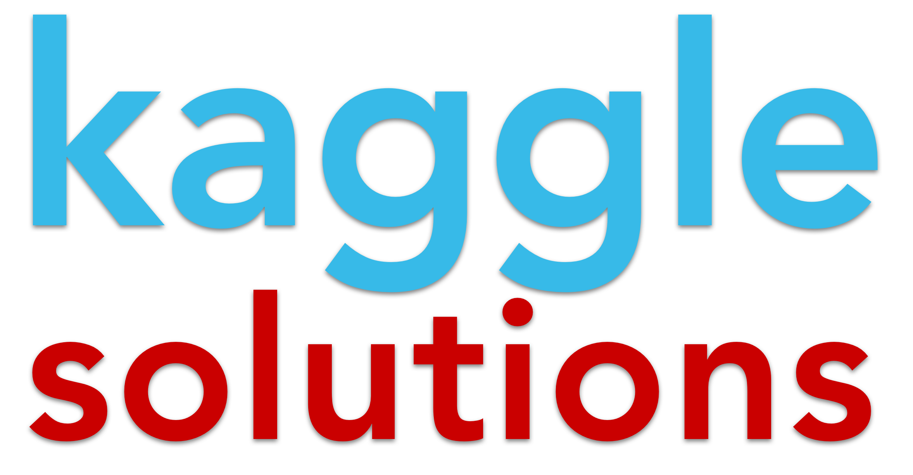
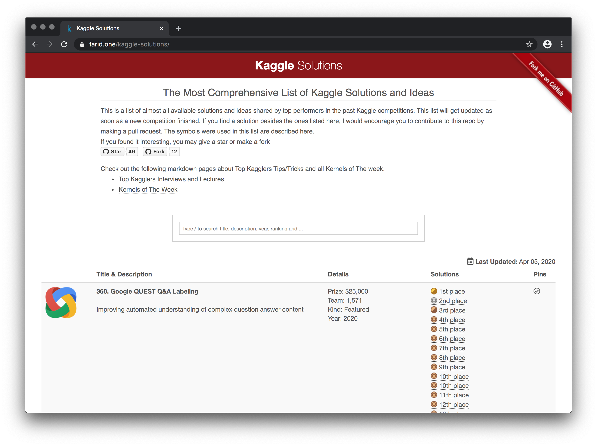
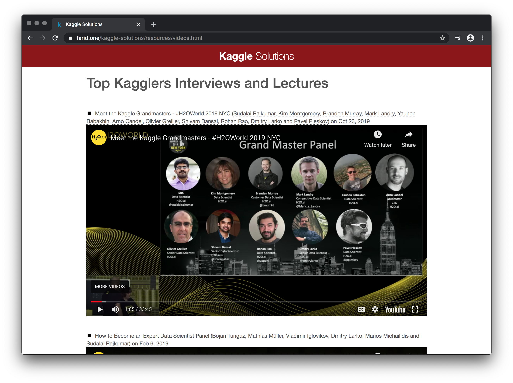

  

  <h1 align="center"></h1>

<!-- 

 -->

  <h3 align="center" style=" border-bottom: 0px;">The Most Comprehensive List of Kaggle Solutions and Ideas</h3>

  <a href="#Overview"><strong>Overview</strong></a> •
  <a href="#Usage"><strong>Usage</strong></a> •
  <a href="#Guideline"><strong>Suggestion</strong></a> •
  <a href="#Suggestion"><strong>Contribution</strong></a>

  
  
  

  

  

## Overview
This repo consists of almost all available solutions and ideas shared by top performers in the past Kaggle competitions. This list gets updated as soon as a new competition finishes. It allows you to search over the Kaggle past competition solutions and ideas.

## Usage
What you only need to do is fork the repo. Then it automatically comes to your Github website to which you can access `https://<YOUR_USER_NAME>.github.io/kaggle-solutions`. After that, you would be able to start learning from the past solutions of each competition and take a note in markdown language.

## Suggestion
If you want to learn a lot from the past competitions, try carefully read the following for every single competition:
<ul>
  <li>Description (Task)</li>
  <li>Evaluation (Metric)</li>
  <li>Data</li>
  <li>Check top performers' profile in Leaderboard</li>
  <li>Most voted Discussion</li>
  <li>Most voted Kernels</li>
</ul>

## Contribution
If you found any solution besides the ones listed here, I would suggest you contribute to this repo by making a pull request.
