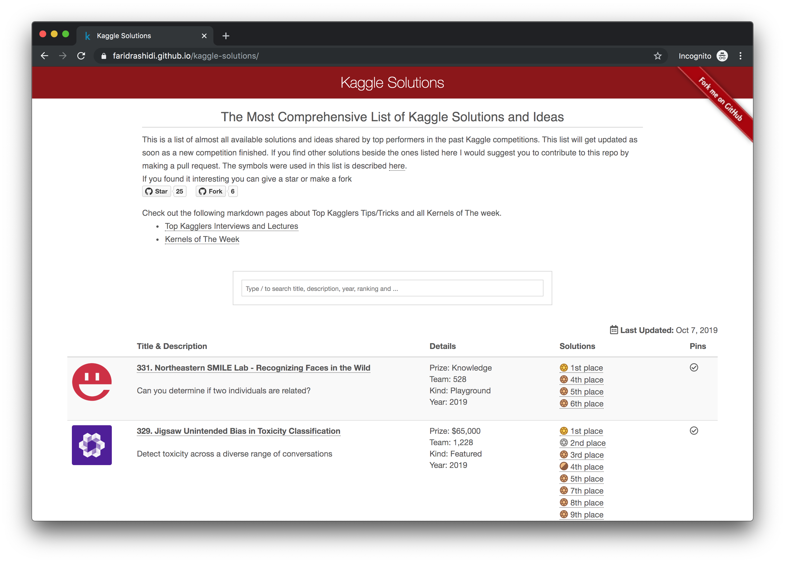

  <h1 align="center">Kaggle Solutions</h1>

  <h3 align="center" style=" border-bottom: 0px;">The Most Comprehensive List of Kaggle Solutions and Ideas</h3>

  <a href="#Overview"><strong>Overview</strong></a> ·
  <a href="#Usage"><strong>Usage</strong></a> ·
  <a href="#Guideline"><strong>Suggestion</strong></a> ·
  <a href="#Suggestion"><strong>Contribution</strong></a>

  
  
  

  

<!-- <h3 style=" padding-bottom: .3em;border-bottom: 1px solid #eaecef;">Overview</h3> -->
## Overview
This repo consists of almost all available solutions and ideas shared by top performers in the past Kaggle competitions. This list will get updated as soon as a new competition finished. It allows you to search over the Kaggle past competitions solutions and ideas.

## Usage
What you only need to do is fork the repo. Then automatically it will come to your Github website which you can access over `https://<YOUR_USER_NAME>.github.io/kaggle-solutions`. After that you would be able to start learning form the past solutions of each competitions and take a note in markdown language.

## Suggestion
If you want to learn a lot from the past competitions, try carefully read the followings for every single competition:
<ul>
	<li>Description (Task)</li>
	<li>Evaluation (Metric)</li>
	<li>Data</li>
	<li>Check top performers' profile in Leaderboard</li>
	<li>Most voted Discussion</li>
	<li>Most voted Kernels</li>
</ul>

## Contribution
If you find other solutions beside the ones listed here I would suggest you to contribute to this repo by making a pull request.
